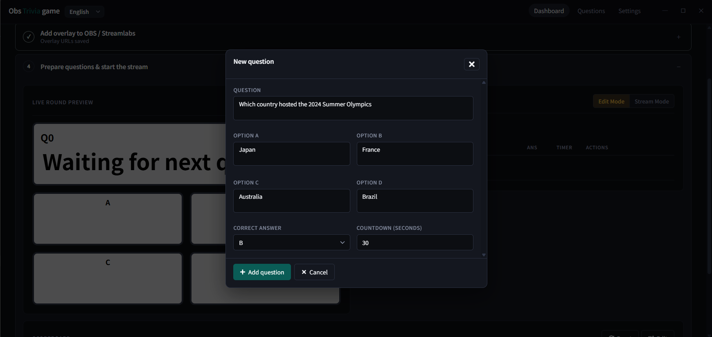
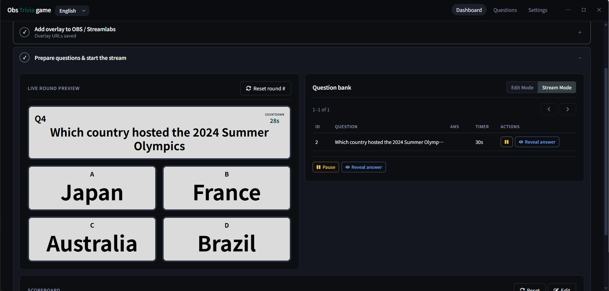

# Obs Trivia game

Twitch chat trivia with live OBS overlays (ABCD votes, scoreboard, countdown).

## Contents

1. [Features](#features)
2. [For streamers (no coding)](#for-streamers-no-coding)
3. [Screenshots](#screenshots)
4. [For developers](#for-developers)
   - [Requirements](#requirements)
   - [Setup](#setup)
   - [Run API only](#run-api-only)
   - [Build UI + API, then start](#build-ui--api-then-start)
   - [Frontend hot reload](#frontend-hot-reload-optional)
   - [Overlay CSS + MCP](#overlay-css-file-split--mcp)
   - [Electron desktop app](#electron-desktop-app)
   - [GitHub Releases](#github-releases)
5. [Twitch chat votes](#twitch-chat-votes)
6. [GraphQL (developers)](#graphql-developers)
   - [Questions](#questions)
   - [Live round](#live-round)
   - [Subscriptions](#subscriptions)
7. [License](#license)

---

## Features

### Control panel
- Windows desktop app (Electron installer) or browser UI at `localhost:4000`
- Guided setup: Twitch sign-in → chat link → OBS overlay URLs → question bank
- Question bank with create / edit / copy / delete, pagination, and per-question timers
- **Edit mode** for managing questions; **Stream mode** to start, pause, resume, and reveal answers
- Live round preview that mirrors the OBS trivia overlay
- Scoreboard with manual edits, typed reset confirmation, and round counter reset

### OBS overlays
- Transparent browser sources for trivia and scoreboard
- Live vote counts, countdown, auto-fitting question/answer text, answer highlight on reveal answers
- Top-10 scoreboard with animated ranks (score × configurable multiplier, default * 10)
- Custom overlay CSS from **Settings** (hot-applies to both overlays)

### Twitch chat
- Viewers vote with `A` / `B` / `C` / `D` — only the first answer per user counts
- Optional templated question post and end-of-timer cutoff message in chat, to ensure clear voting windows even with short timers or if there's streaming/chat delay.
- Correct voters score when you reveal; reconnect / test-message tools in setup

### Extras
- Settings for chat templates, score multiplier, and overlay CSS
- MCP endpoint for AI-assisted overlay CSS and question CRUD
- GitHub Releases with a prebuilt Windows `.exe`

---

## For streamers (no coding)

1. Download the Windows installer (`ObsTriviaGame-*-x64.exe`) from the [Releases page](https://github.com/ayame30/obs-trivia-game/releases).
2. Install / double-click to open **Obs Trivia game**.
3. Sign in with Twitch in the app and finish the setup steps.
4. In OBS or Streamlabs, add **Browser Sources**:
   - Trivia overlay: [http://localhost:4000/overlay/questions](http://localhost:4000/overlay/questions)
   - Scoreboard: [http://localhost:4000/overlay/scoreboard](http://localhost:4000/overlay/scoreboard)
5. Keep the app **running** while you stream.

To stop: close the app window.

If Windows SmartScreen appears, choose **More info** → **Run anyway**.

---

## Screenshots





---

## For developers

### Requirements

- Node.js 22.5+

### Setup

```bash
cp .env.example .env
# Set TWITCH_CLIENT_ID

cd frontend
cp .env.example .env
# Set VITE_TWITCH_CLIENT_ID (same value)
npm install
cd ..
npm install
```

### Run API only

Nest serves the built frontend from `frontend/dist`, so build the UI first:

```bash
cd frontend && npm run build && cd ..
npm run dev
```

### Build UI + API, then start

Builds the frontend and Nest server, then starts Nest (which again serves `frontend/dist`):

```bash
npm run build:start
```

| Surface | URL |
|---------|-----|
| App | [http://localhost:4000/](http://localhost:4000/) |
| Trivia overlay | [http://localhost:4000/overlay/questions](http://localhost:4000/overlay/questions) |
| Scoreboard overlay | [http://localhost:4000/overlay/scoreboard](http://localhost:4000/overlay/scoreboard) |
| Twitch OAuth redirect | [http://localhost:4000/](http://localhost:4000/) (register this URI on your Twitch app) |
| Overlay CSS + Question CRUD MCP | [http://localhost:4000/mcp](http://localhost:4000/mcp) (`POST`) |

### Frontend hot reload (optional)

```bash
# terminal 1
npm run dev

# terminal 2
cd frontend && npm run dev
```

Vite proxies `/graphql` to the API. UI: [http://localhost:3001](http://localhost:3001)  
OAuth still redirects to port **4000** when using Vite (see `VITE_TWITCH_REDIRECT_ORIGIN`).

### Overlay CSS (file split + MCP)

| File | Role |
|------|------|
| [`frontend/src/styles/dashboard.css`](frontend/src/styles/dashboard.css) | App chrome |
| [`frontend/src/styles/overlay.css`](frontend/src/styles/overlay.css) | OBS overlays |
| [`frontend/src/styles/base.css`](frontend/src/styles/base.css) | Shared tokens / forms |
| [`frontend/src/styles/global.css`](frontend/src/styles/global.css) | Imports the three above |

Custom CSS is editable in **Settings → Overlay custom CSS**, or via MCP on the running API (`POST` [http://localhost:4000/mcp](http://localhost:4000/mcp)).

#### Supported MCP tools

Server name: `obs-trivia-game` · endpoint: `POST /mcp`

| Tool | Description |
|------|-------------|
| `get_mcp_endpoint` | Returns this HTTP MCP path (`/mcp`) |
| `get_overlay_style_guide` | Safe overlay CSS selectors and rules for OBS overlays |
| `get_overlay_css` | Reads the current `overlayCustomCss` setting |
| `set_overlay_css` | Replaces `overlayCustomCss` with a full CSS document |
| `get_question_writing_guide` | Overlay layout rules for question/answer text (read before create/update) |
| `list_questions` | Lists the question bank (`offset` / `limit` pagination) |
| `get_question` | Fetches one question by id |
| `create_question` | Creates a question (A–D options, correct answer, optional countdown) |
| `update_question` | Updates fields on an existing question |
| `delete_question` | Deletes a question (fails if it is in an active round) |

Example client config (with the app running):

```json
{
  "mcpServers": {
    "obs-trivia-game": {
      "url": "http://127.0.0.1:4000/mcp"
    }
  }
}
```

### Electron desktop app

```bash
# Dev: builds server+UI, opens Electron window
npm run electron:dev

# Windows NSIS installer → release/
npm run dist:win
```

`dist:win` packs Nest + production `node_modules` into `electron-resources/server` (pruned), keeps only the `en-US` Electron locale, then builds an NSIS installer. Expect roughly **~90–110 MB** for the `.exe` — most of that is Chromium inside Electron; the Nest server payload is trimmed separately.

## GraphQL (developers)

### Questions

```graphql
mutation {
  createQuestion(input: {
    text: "What is 2+2?"
    optionA: "3"
    optionB: "4"
    optionC: "5"
    optionD: "6"
    correctAnswer: B
  }) {
    id
    correctAnswer
  }
}
```

### Live round

```graphql
mutation { startQuestion(questionId: "1") { round { id } warning } }

mutation { stopQuestion { id question { correctAnswer } voteCounts { A B C D total } } }
```

### Subscriptions

```graphql
subscription {
  questionStarted {
    id
    question { text optionA optionB optionC optionD }
    voteCounts { A B C D total }
  }
}

subscription {
  voteCountsUpdated { A B C D total }
}

subscription {
  questionEnded {
    id
    question { correctAnswer }
    voteCounts { A B C D total }
  }
}

subscription {
  scoreboardUpdated {
    displayName
    score
  }
}
```

Correct answers award +1 point on `stopQuestion`. Use `resetScoreboard` to clear scores.

```graphql
mutation {
  updateScoreboard(updates: [
    { twitchUserId: "12345", delta: 5 }
    { twitchUserId: "67890", score: 10 }
  ]) {
    twitchUserId
    displayName
    score
  }
}
```

Each item must include **exactly one** of `score` or `delta`. Scores never go below 0.

Use `resetRounds` to clear rounds/votes and reset the round counter.

## License

This project is licensed under the [GNU Affero General Public License v3.0](LICENSE) (AGPL-3.0-only).
